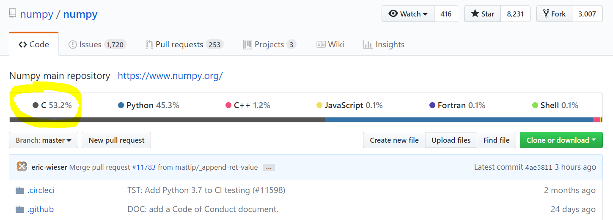
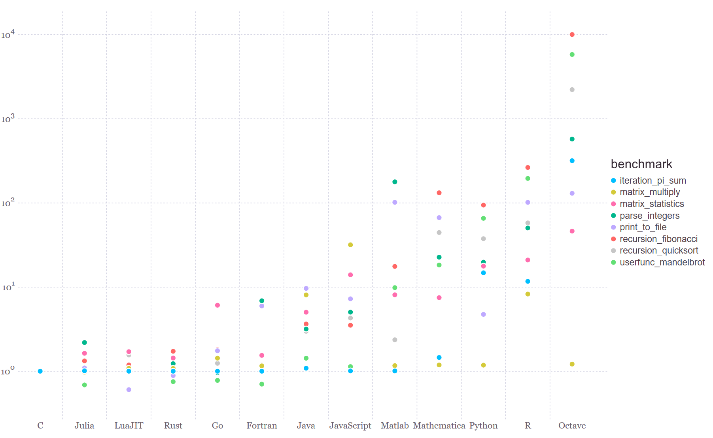
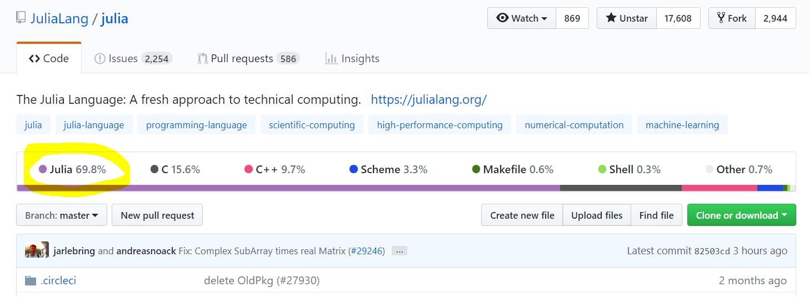
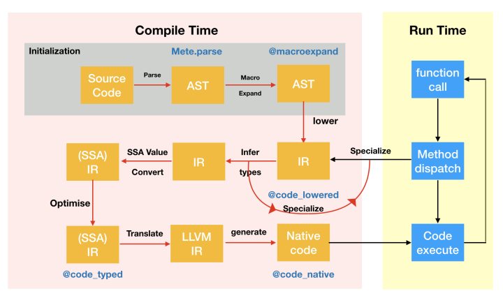
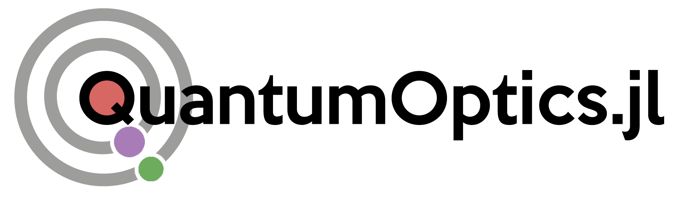

 <!-- .element height="10%" width="10%" -->

# Julia

A programming language *specifically* made for scientists

<sup><sup><sup><span style="color: #666">Carsten Bauer @ University of Cologne, October 2018</span></sup> </sup></sup>


Note: ~5 years ago at MIT

---

## Disclaimer

* This workshop will be opinionated!

* This workshop will be incomplete!

* The topics will (likely) be too easy and too difficult!

* This workshop is about Julia! There are other great languages, too!

---

##  What does science need from a programming language?

----

## Typical workflow

1. How can I answer the question using computers?

2. Implement those ideas

3. Run the code

4. Analyze and visualize results

5. Realize that your results are full of nonsense

6. Debug

7. Run the code again

----

## What we want

* Great performance of "doing research"

* Great performance of computation

* Source code that is concise and easy to read & understand

* Code that is easy to install, share, use, and replicate

* Free and open source

----

## Compiled

* `C`, `Java`, `Fortran`, `Go`, `Haskell`, `Rust`

* **Static**: you can't change anything once compiled

* **Fast**: many things are known about objects

* Industry standard

* **Critique**: too low-level, no interactivity

Note: Two main types of languages: Compiled and interpreted

----

## Interpreted

* `MATLAB`, `Python`, `R`, `Mathematica`, `JavaScript`

* **Dynamic**: write → (interpretation-layers) → run

* **Slow**: Few is known about objects (hard to optimize)

* Easy to code and interactive

* **Critique**: too slow, black box

Note: interpreted language is best suited for back and forth coding, test, look, repeat. Statistically, most relevant for scientific work.

---

# Two-language problem

Note:
Has two facettes:
1. prototyping -> recoding in Fortran
2. understanding libraries

----

## Writing scientific code

1. Brain-storm and prototype in an interpreted language for exploration and testing.
2. Deliver a performant final-version in a compiled language.

Note: two choices: stay in one domain (coding/exploration) or switch between two languages

----

## black boxes in interpreted languages

```none
Does a package/library do exactly
what you need?
             ├── Yes:   Great!
             ├── Dunno: Damn it, it's written in C/Fortran.
             └── No:    You need to (learn to) code in C/Fortran.
```

Note:  R, Python, and MATLAB are coded mostly in C/++.  Anything that is fast in those languages is coded in a low-level language!

----

## NUMPY Codebase



----

## What if the interpreted language is fast enough?



----

# Julia Codebase



Note: Julia is mostly coded in Julia!

----

## Expressive and fast


---

## The Julia Project

* Begun in 2009 as part of Jeff Bezanson's PhD thesis @ MIT.

* First major release of Julia 1.0 in August 2018.

	* already > 2 million downloads

* ~750 core language contributors

* 1600+ external packages

Note:
Python is 30 years old (1989)

----

## Community

* Developed by scientists
* Very inviting and excellent
* Many experts that used to code in C/Fortran

---

# Dynamic & fast, how?

1. Just-in-time compilation (JIT): User-level code is compiled to machine code on-the-fly.

2. Meticulous type system: Designed to maximize impact of JIT.

3. Multiple dispatch: Function dispatch determined at compile time when possible, run time when not.

Note: JIT compilation times are slow for first run

----

## From source to machine code

<!-- .element height="70%" width="70%" -->

---

# Syntax clarity

Looks like `Python`/`MATLAB`/`R` but with prettier syntax.

----

## Unicode

<section style="text-align: left;">
Math:
```julia
2π√3/5α₀
```
`Python`:
```python
2*np.pi*np.sqrt(3)/(5*alpha0)
```
`Julia`:
```julia
2π*√3/5α₀
```

Note: which one is closer to the mathematical formulation? I didn't even put C/Fortran on this slide...

----

## Custom infix operators

```julia
# rotate coordinate `c` by `θ` radians
julia> ↺(c, θ) = [cos(θ) -sin(θ); sin(θ) cos(θ)]*c
↺ (generic function with 1 method)

julia> [1,0] ↺ π/2
2-element Array{Float64,1}:
 0.0
 1.0   
```

Note: You might say, ok, but who ever uses this? No one!

----

## Example: Tensor product

```julia
⊗ # Tensor product operator (\otimes)
ψx = gaussianstate(b_position, x0, p0_x, σ)
ψy = gaussianstate(b_position, y0, p0_y, σ)
ψ = ψx ⊗ ψy
```

<!-- .element height="35%" width="35%" -->

----

## Units

It took a beetle 36 seconds to walk 25 cm. How many days will it take it to walk 3 km?

```julia
v = 25cm / 36s
t = 3km / v
uconvert(d, t)
```
5 days

---

# Interfacing

Call C and Fortran libraries with **zero overhead**!

Full access to libraries and functionalities you already know. 

`PyCall.jl`, `Cxx.jl`, `RCall.jl`, `Mathematica.jl`, ...

Note: you can call Julia home without losing all of your furniture in the move.

----

# `PyCall.jl`

```julia
using PyCall
@pyimport numpy as np
x = rand(2,2)                # Note, that this is a Julia array!
result = np.linalg.eigs(x)
```

---

# Free & open source

* Enables highly specialized and niche solutions and tools
* No "black boxes", everything is within reach
* Language design decision are transparent and democratic

---

# Disadvantages
It's still relatively young…

----

## Teething problems

* Ecosystem (e.g. some packages, IDEs, debugger) not as mature as in other environments.
* Many pure Julia implementations missing
* Harder to find answers online.

----

## Still working out all the kinks 

* Loading some packages is still a bit slow.
* Plotting works but hasn't settled yet.
* Recent release of `v1.0.0`: many minor inconveniences.

---

# Julia is great

* People come to `Julia` because of its speed, but stay for the type-dispatch system
* A number of libraries already far out-perform their equivalents in other languages.
* Most compiler optimizations are yet to come!

Note: The pros already outweigh the cons.

---

## Highly recommended talks

* [Nick Eubank: What Julia Offers Academic Researchers](https://www.youtube.com/watch?v=C4dMYHzW-SY)

* [George Datseris: Why Julia is the most suitable language for science](https://www.youtube.com/watch?v=7y-ahkUsIrY)

---

<!-- .slide: data-background-color="#ffffff" -->

 <!-- .element height="100%" width="100%" -->

---

<!-- .slide: data-background-color="#ffffff" -->

## Workshop material

<sup>`git clone https://github.com/crstnbr/julia-workshop`</sup>